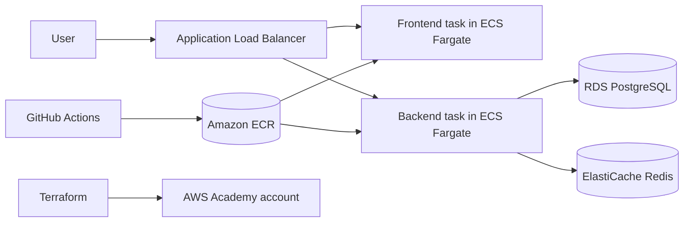

# URL Shortener

Academic URL shortener with click analytics and a full CI/CD and infrastructure workflow. The project is built to run locally with Docker Compose and to deploy in AWS Academy using Terraform, ECS Fargate, an Application Load Balancer, RDS, and ElastiCache.

## Architecture

- Backend: FastAPI with Python 3.12
- Frontend: React 19 + Vite
- Database: PostgreSQL 16
- Cache: Redis 7
- Infrastructure: Terraform, Amazon ECS Fargate, ALB, RDS, ElastiCache, ECR, S3 remote state
- Delivery: GitHub Actions and Docker images



## Repository Layout

- `backend/`: FastAPI application, models, schemas, tests, and backend Dockerfile
- `frontend/`: React application, tests, and frontend Dockerfile
- `infra/`: Terraform modules and environment definitions for AWS Academy deployment
- `docker-compose.yml`: local full-stack stack for development
- `docs/`: supporting documentation

## Local Development

### Prerequisites

- Docker and Docker Compose
- Python 3.12 if you want to run the backend outside containers
- Node.js 20+ and pnpm if you want to run the frontend outside containers

### Run everything with Docker

```bash
docker compose up --build
```

This starts PostgreSQL, Redis, the backend, and the frontend.

### Backend only

```bash
cd backend
pip install -r requirements.txt
uvicorn app.main:app --reload --host 0.0.0.0 --port 8000
```

### Frontend only

```bash
cd frontend
pnpm install
pnpm dev
```

## AWS Academy Deployment

The infrastructure is designed for the AWS Academy lab environment. The Terraform stack expects:

- an AWS Academy `LabRole`
- an S3 bucket for remote Terraform state
- ECR repositories for the backend and frontend images
- credentials and permissions in the AWS Academy account for ECS, ALB, RDS, ElastiCache, ECR, IAM, S3, and Secrets Manager

The staging environment is defined under `infra/environments/staging`, with `us-east-1` as the target region. The same structure can be reused for production with the production environment folder.

### AWS Academy Checklist

1. Configure the AWS Academy lab account and make sure the `LabRole` ARN is available.
2. Create or verify the S3 bucket used for Terraform remote state.
3. Create the ECR repositories for the backend and frontend images.
4. Fill in `infra/environments/staging/terraform.tfvars` from the example file.
5. Apply the Terraform stack from `infra/environments/staging`.
6. Build and push both container images to ECR.
7. Deploy the ECS services and confirm the ALB DNS name is reachable.
8. Verify the backend can connect to RDS and Redis through the expected environment variables.

## Testing

Backend:

```bash
cd backend
pytest
```

Frontend:

```bash
cd frontend
pnpm test
```

## Notes

- The backend reads database and Redis settings from environment variables and can use either full URLs or split host-based settings in ECS.
- Do not commit AWS secrets, passwords, or `.env` files.
- See `infra/environments/staging/terraform.tfvars.example` for the Terraform variables you need to provide.
